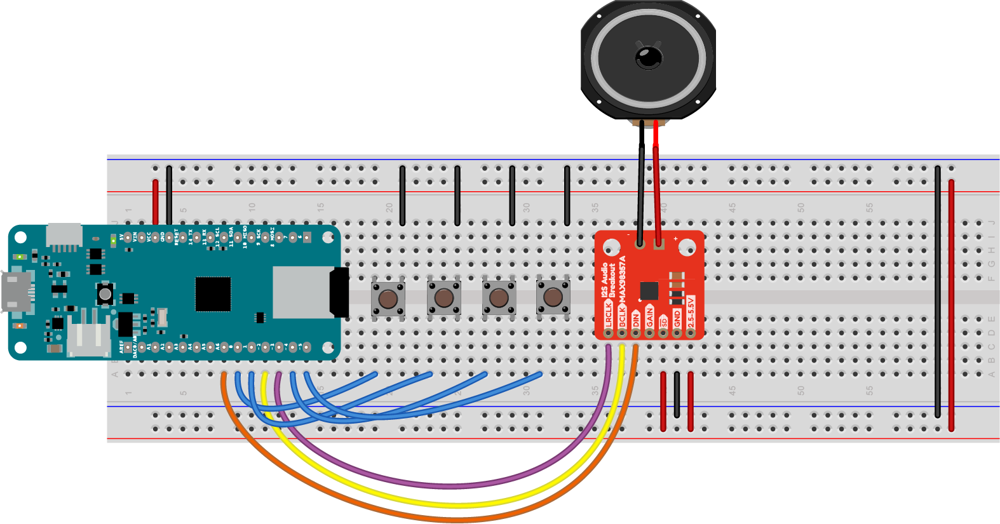

# Pushbutton Triggering of Multiple Sample Files using ArdunoSound Library

This example This sketch plays one of four .wav files when you press one of four corresponding pushbuttons. Pushbuttons are connected to pins 2 through 5. Their other sides are connected to ground. Pressing each starts playing a.wav file from the SD card. The sound files are called SOUND1.WAV through SOUND4.WAV.

The circuit below shows the wiring for the MAX98357 amp and a MKR Zero board. It can be used with other MKR boards and MKR-compatible boards if you attach an external SD card module or shield, and change the SD card SS pin accordingly.

*Figure 1. MAX98357 I2S audio amplifier connected to a MKR Zero. The board is shown rotated so that the top of the board is on the left side of the image. The amp is mounted on the breadboard below the MKR Zero, with the pins on the left side. The pins, numbered from top left, are: LRC; BCLK; DIN; GAIN; SD; GND; Vin.  The amp's pin 1 (LRC) is connected to the MKR Zero's digital pin 3 (physical pin 11). The amp's pin 2 (BCLK) is connected to the MKR Zero's digital pin 2 (physical pin 10). The amp's pin 3 (DIN) is connected to the MKR Zero's pin A6 (physical pin 8). The amp's pin 5 (SD, or shutdown) is connected to the 3.3V bus. The amp's pin 6 (GND) is connected to the ground bus and pin 7 (Vin) is connected to the 3.3V  bus. The pushbuttons are connected to the MKR Zero's digital pins 0, 1, 4, and 5. The other pins of the pushbuttons are connected to ground.* 
