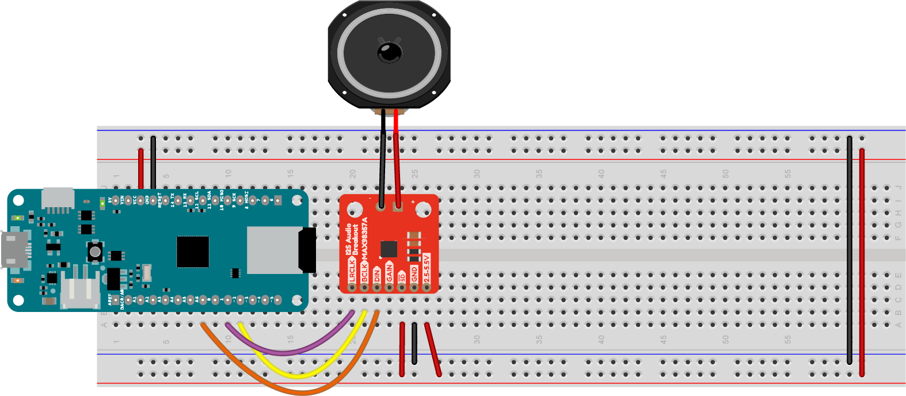

# The Inter-IC Sound (I2S) Protocol 

The *Inter-IC Sound protocol*, or *I2S*, is a protocol for tramsmitting digital audio from one device to another. It transfers pulse-code modulated (PCM) audio data, the standard for digital audio, from one integrated circuit (IC) to another. The standard was developed by Philips in the 1980's and 90's. 

I2S can be used to send pre-recorded audio files from a microcontroller to an amplifier or Digital-to-Analog converter (DAC). It can also be used to digitize audio from a microphone. There is no compression protocol in I2S itself, so you can't play MP3 or OGG files or other audio formats that compress the audio, but you can play WAV files. 

The MKR Zero and other Arduino modules in the MKR family can communicate using I2S. In the examples that follow, you'll see how to use an I2S amplifier to play WAV files from an SD card, and how to analyze audio coming from an I2S microphone.  

## I2S Electrical Connections 

I2S is a synchronous serial bus protocol, meaning that you can connect multiple devices on the same common wires. The connections for an I2S bus are:

* Serial clock (SCK) or Bit Clock (BCLK): the line that carries the clock signal
* Frame Select (FS), also called Word Select (WS), or Left-Right Clock (LRC): determines left and right channels
* Data (SD), also called Digital Out (DOUT) or Digital In (DIN) depending on the application: the data signal itself.

The controlling device sends the clock signal, just like in other synchronous serial protocols like I2C and SPI. For more on the technical details, see the [I2S specification](https://www.cypress.com/file/133906/download), as explained on Cypress' site. 

The Arduino [I2S](https://www.arduino.cc/en/Reference/I2S)  and the [ArduinoSound](https://www.arduino.cc/en/Reference/ArduinoSound) libraries support I2S. 

The typical connections are as follows:

* BCLK connects to pin 2 of the MKR board
* LRC connects to pin 3 of the MKR board
* SD connects to pin A6 of the MKR board

This wiring is shown in Figure 1 with a MSX98357 I2S amplifier, and in Figure 2 with a UDA1334 Digital-to-Analog (DAC) module, and Figure 3 with an I2S microphone. You'll see this wiring repeated the examples that follow.

The first two modules take an I2S signal as input and output analog audio. The micrphone generates an I2C signal from acoustic input. The MAX98357 has a built-in amp, allowing you to attach it to speakers. The UDA1334 DAC module has no amp, but has a stereo mini jack that you can use to connect it to headphones or an amp. 

*Figure 1. MAX98357 I2S audio amplifier connected to a MKR Zero. The amp is mounted on the breadboard below the MKR Zero, with the pins on the left side. The pins, numbered from top left, are: LRC; BCLK; DIN; GAIN; SD; GND; Vin.  The amp's pin 1 (LRC) is connected to the MKR Zero's digital pin 3 (physical pin 11). The amp's pin 2 (BCLK) is connected to the MKR Zero's digital pin 2 (physical pin 10). The amp's pin 3 (DIN) is connected to the MKR Zero's pin A6 (physical pin 8). The amp's pin 6 (GND) is connected to the ground bus and pin 7 (Vin) is connected to the 3.3V  bus.*

*Figure 2. UDA1334 I2S DAC connected to a MKR Zero. The DAC is mounted below the MKR Zero on the breadboard, with the audio jack pointed to the bottom of the breadboard, away from the MKR Zero. The DAC's pins, numbered in a U from top left, are: Vin; 3V out; GND; WSEL; DIN; BCLK; LOUT; AGND; ROUT; then on the right, from bottom right: DEEM; PLL; SF0; MUTE; SF1; SCLK. Pin 1 (Vin) is connected to  the 3.3V  bus. Pin 3 (GND) is connected to the ground bus. Pij 4 (WSEL) is connected to the MKR Zero's digital pin 3 (physical pin 11). Pin 5 (DIN) is connected to the MKR Zero's pin A6 (physical pin 8). The DAC's pin 6 (BCLK) is connected to the MKR Zero's digital pin 2 (physical pin 10). The rest of the pins remain unconnected.*

*Figure 3. INMP1441 I2S Mic  connected to a MKR Zero. The Mic is mounted on the breadboard below the MKR Zero. The Mic's pins, numbered in a U pattern from top left, are: L/R select; WS; SCK; SD; 3V; GND.  Pin 2 (WS) is connected to digital pin 3 on the MKR Zero (physical pin 11). Pin 3 of the mic (SCK) is connected to digital pin 2 on the MKR Zero (physical pin 10). Pin 4 of the mic (SD) is connected to pin A6 of the MKR Zero (physical pin 8). Pin 5 of the mic (3V) is connected to the 3V bus. Pin 6 of the mic (GND) is connected to the ground bus.*

## Examples

* [WAV file playback with volume control](https://github.com/tigoe/SoundExamples/tree/master/ArduinoSound_Examples/WaveVolumeControl)
* [WAV file playback with pause/play control](https://github.com/tigoe/SoundExamples/tree/master/ArduinoSound_Examples/WavePlayPause)
* [Playback of multiple WAV files](https://github.com/tigoe/SoundExamples/tree/master/ArduinoSound_Examples/WavePlaybackMultipleFiles)
* [Sampler-style playback of multiple files](https://github.com/tigoe/SoundExamples/tree/master/ArduinoSound_Examples/WaveSamplePlayer)
* Audio tone generator using I2S
* [Microphone input with pitch detection](https://github.com/tigoe/SoundExamples/tree/master/ArduinoSound_Examples/PitchDetector)
* [Pitch-to-MIDI detector](https://github.com/tigoe/SoundExamples/tree/master/ArduinoSound_Examples/PitchToMidi)

* Microphone input with amplitude detection

